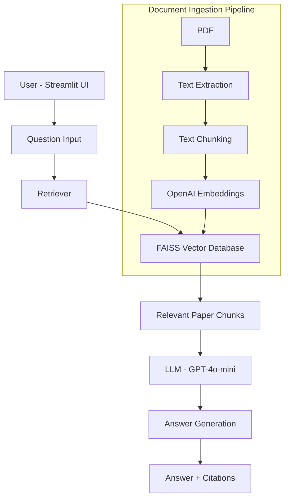

# AI Research Paper Assistant (RAG + LLM)

An AI-powered research assistant that can read research papers and answer questions with citations.

## Features

- Upload research papers
- Ask questions about papers
- Multi-document retrieval
- Paper comparison
- Citation tracking
- Chat-style UI

## Tech Stack

- Python
- LangChain
- OpenAI GPT-4o-mini
- FAISS Vector Database
- Streamlit
- Retrieval-Augmented Generation (RAG)

## Architecture

PDF → Chunking → Embeddings → Vector Database → Retriever → LLM → Answer



## Installation

Clone the repository

```bash
git clone https://github.com/Vaishuu-creator/researchmind-rag-assistant.git
cd researchmind-rag-assistant
```

Install dependencies

```bash
pip install -r requirements.txt
```

Create .env file
```ini
OPENAI_API_KEY=your_api_key_here
```

Run the application
```bash
streamlit run app.py
```

## Example Questions

- What classifiers were used in these papers?
- Compare the PCOS prediction methods.
- What dataset was used in the research?
- What is the conclusion of the paper?

